# Potability of water
Ensuring access to potable water is a fundamental human right. Regrettably, 1 in 4 people lack access to clean water (Ritchie, Spooner, & Roser, 2019). Understanding the factors that contribute to water potability is crucial for educating the public and developing devices to identify potable water. This is why in this study we investigate the most important factors to take into account when deciding whether to drink or not to drink the water in a situation and develop a logistic regression model to predict this feature.

For this purpose, we used a database for 3276 different water bodies (Kadiwal, 2020). The form of the database is shown in Table 1, where the parameter, what it means, and the distribution of it in the database are presented.

## Table 1
| **Parameter**        | **Description**                                                          | **Distribution**                                                              |
|----------------------|--------------------------------------------------------------------------|-------------------------------------------------------------------------------|
| **pH**               | Measures the acidity or alkalinity of water on a scale from 0 to 14. According to the World Health Organization, most drinking water has a pH range of approximately 6.5 to 8.5 (2007). | 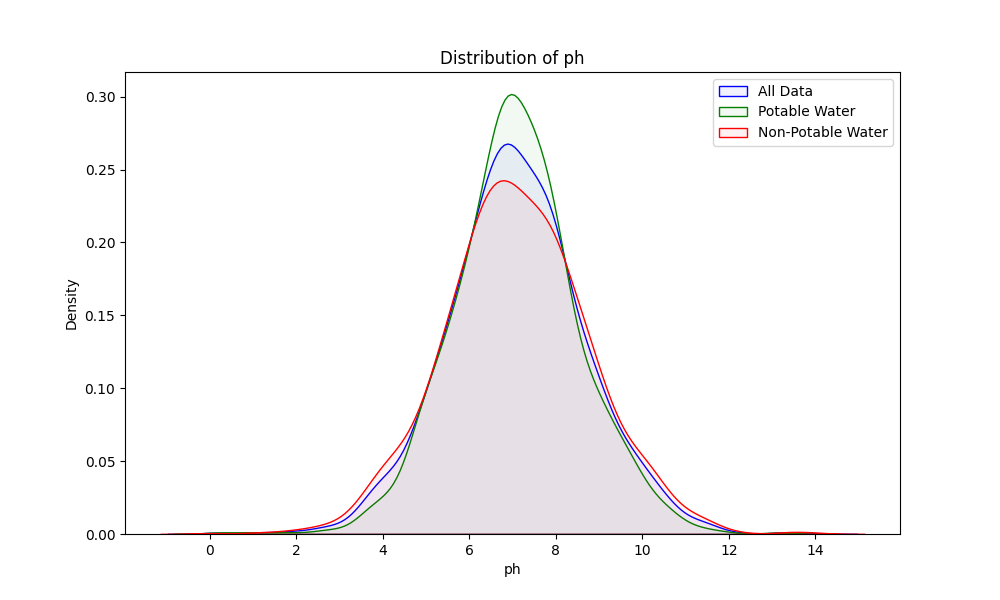                    |
| **Hardness**          | Measure in mg/L of the concentration of calcium and magnesium salts in water. The U.S. Geological Survey (2018) classifies water with hardness less than 60 mg/L as soft, 61-120 mg/L as moderately hard, 121-180 mg/L as hard, and more than 180 mg/L as very hard. | 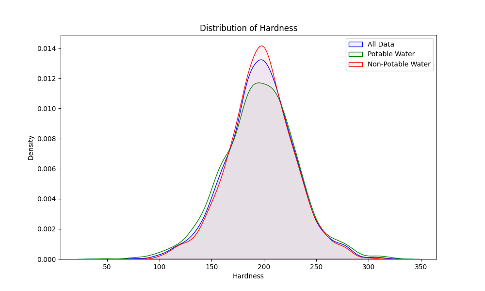        |
| **Solids**            | Total dissolved solids (TDS) in water in ppm. A high TDS means the water is highly mineralized. According to the Environmental Systems Research Institute (2016), the desirable limit for TDS in potable water is 500 mg/L and the maximum limit is 1000 mg/L. | 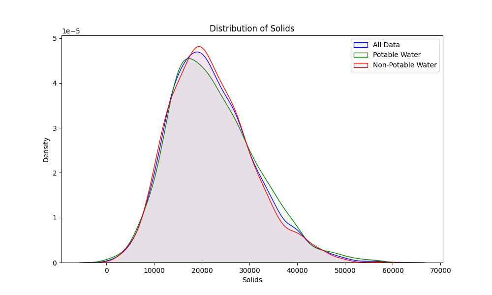            |
| **Chloramines**       | Compounds of chlorine and ammonia in ppm used commonly to disinfect water. Chloramine levels up to 4 milligrams per liter are considered safe. (Centers for Disease Control and Prevention, 2024)              |   |
| **Sulfate**           | Measure of sulfate ions in water in mg/L. The U.S. Environmental Protection Agency (EPA) recommends a secondary maximum contaminant level of less than 250 mg/L for sulfate in drinking water (2019). | 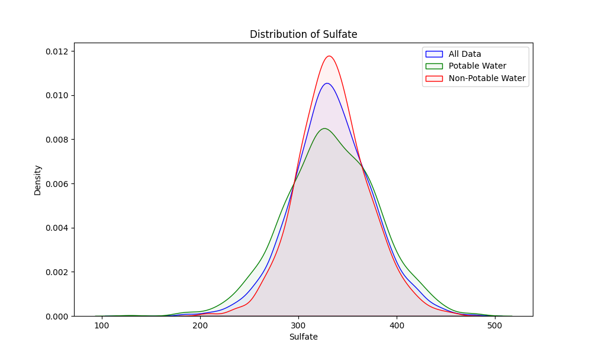          |
| **Conductivity**      | Measure of water's ability to conduct electricity in μS/cm. According to the Environmental Systems Research Institute (2016) it should be less than 400 μS/cm. High conductivity levels may indicate a high concentration of dissolved salts. | 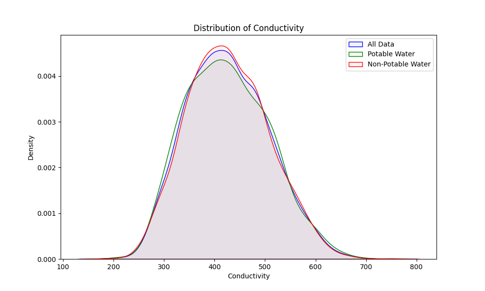|
| **Organic Carbon**    | Measure of organic compounds in water in ppm. | 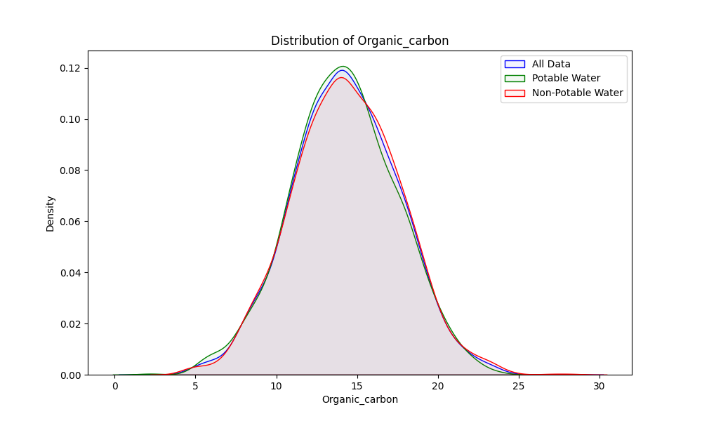 |
| **Trihalomethanes**   | Chemical compounds that can form during water chlorination in μg/L. | 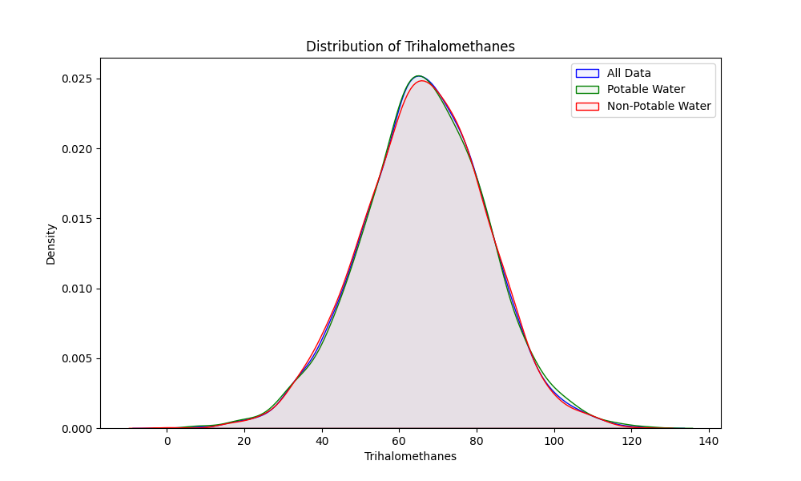|
| **Turbidity**         | Measure of water clarity in NTU (Nephelometric Turbidity Units). Turbidity indicates how clear or cloudy water is, which can be affected by the presence of suspended particles. | 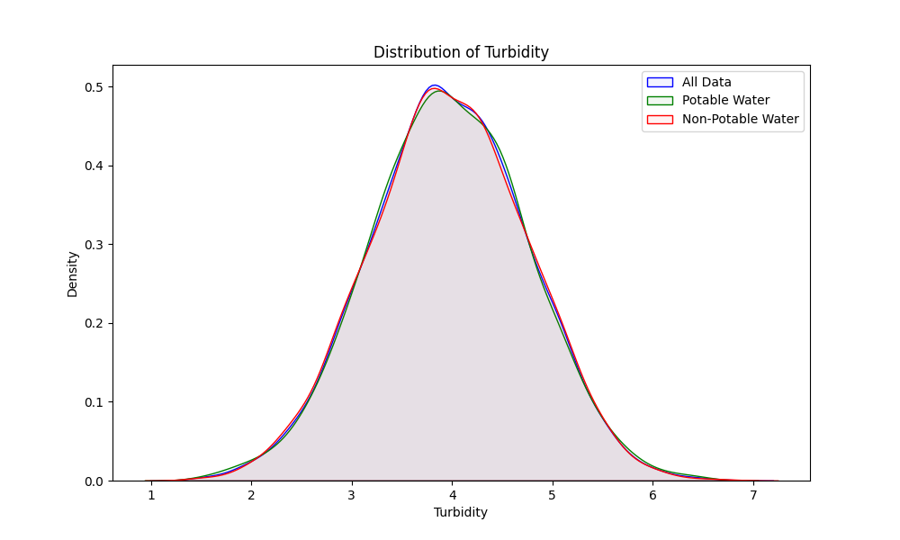      |
| **Potability**        | Indicates if water is safe to drink (binary variable).                   | 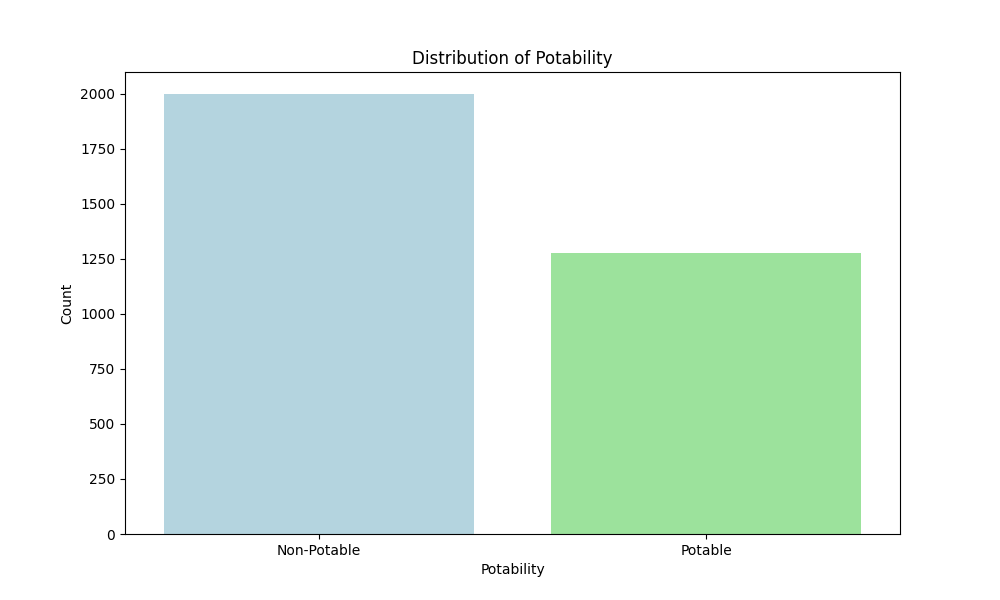    |

For most multivariable statistic applications, our data must be normal. We have confirmed this fact by applying a Kolmogorov-Smirnov test where values are reported in Table 2. Q-Q plots of the data are also shown.

### Table 2

| Parameter                     | p-value           | Normality (p > 0.05) | Q-Q Plot |
|--------------------------------|-------------------|----------------------|----------|
| pH                             | 0.279             | True                 | 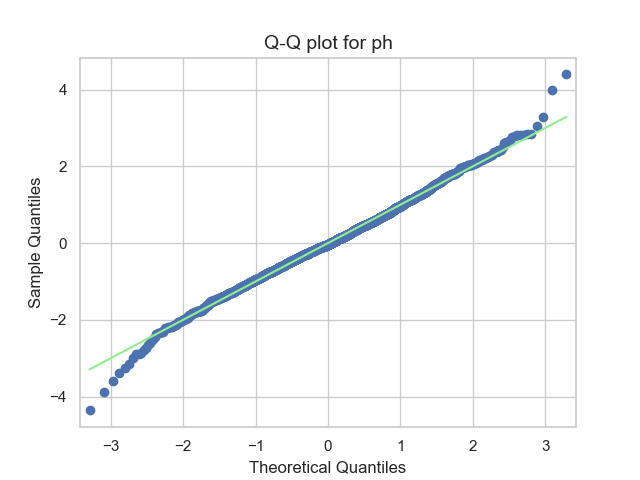 |
| Hardness                       | 0.056             | True                 | 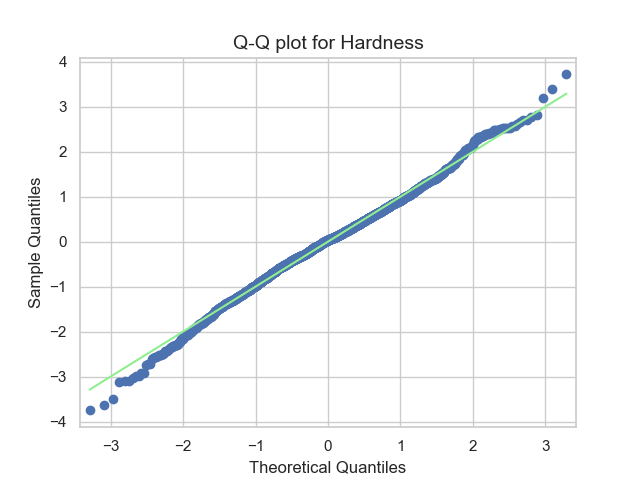 |
| Solids                         | 0.000             | False                | 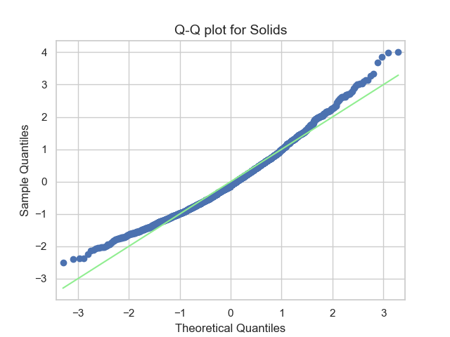 |
| Solids (sqrt transformed)      | 0.679             | True                 | 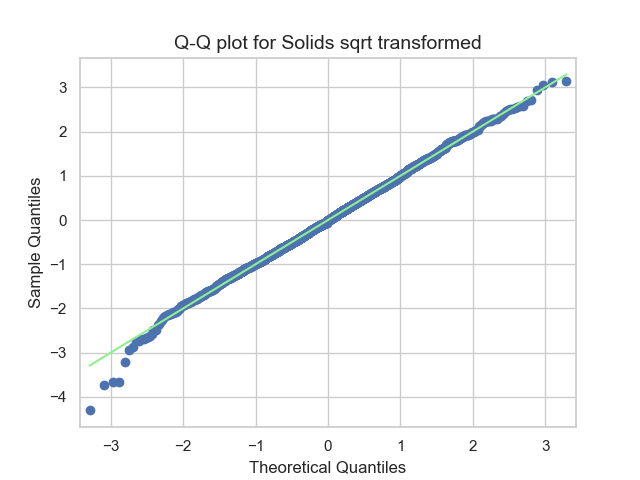 |
| Chloramines                    | 0.271             | True                 | 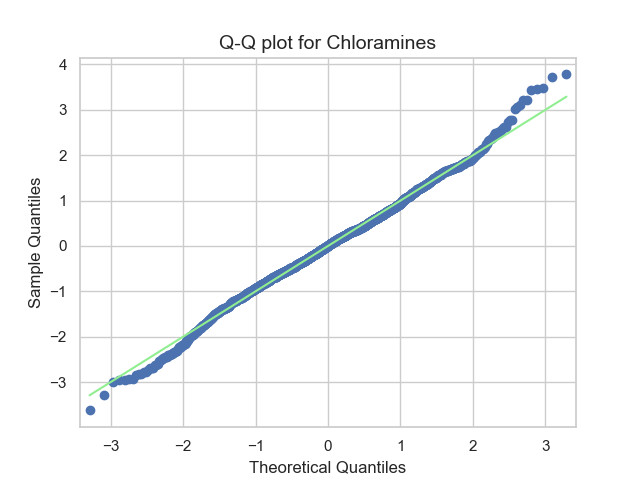 |
| Sulfate                        | 0.082             | True                 | 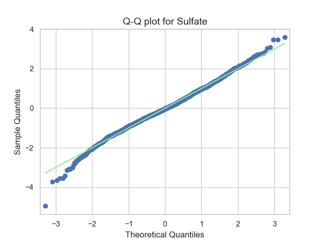 |
| Conductivity                   | 0.071             | True                 | 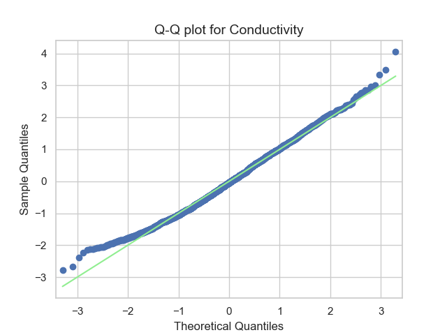 |
| Organic Carbon                 | 0.845             | True                 | 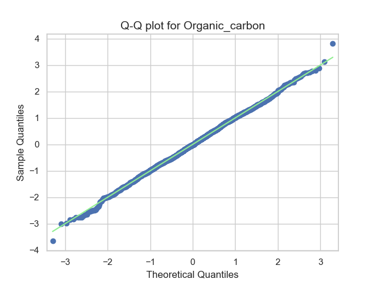 |
| Trihalomethanes                | 0.129             | True                 | 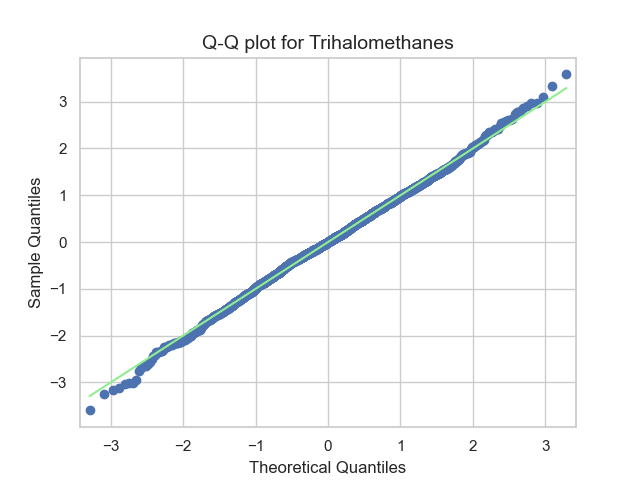 |
| Turbidity                      | 0.876             | True                 | 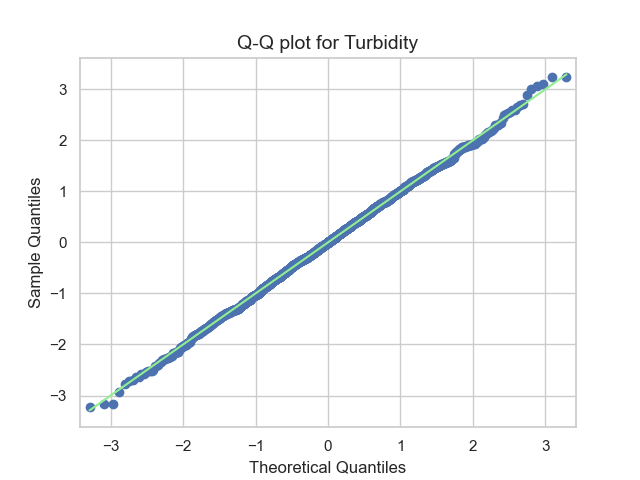 |

Note that the "Solids" variable did not follow a normal distribution initially, but after applying a square root transformation, it now conforms to a normal distribution. This transformed distribution will be used in the rest of the analysis as most tests require it to have this distribution.
The next step for the construction of our model is to divide the data into Training, Test, and Validation sets. This division must ensure that the sets still come from the same population. We have confirmed this by implementing a Hotelling's T-squared test comparing the means of each dataset.

- **Train vs Validation**: The T²-statistic of 13.034 and a p-value of 0.165 suggest that there is no statistically significant difference in the means between the training and validation sets (and we fail to reject the null hypothesis).

- **Train vs Test**: The T²-statistic of 7.799 and a p-value of 0.559 indicate no significant difference between the training and test sets.

- **Validation vs Test**: With a T²-statistic of 6.890 and a p-value of 0.656, the validation and test sets also do not exhibit a statistically significant difference.

Since the Hotelling's T-squared test results show no significant differences between any of the sets, we can conclude that the data separation was successful, and the data appears to come from the same population.

# Logistic Regression Analysis

## Objective of Logistic Regression in Potability Analysis

**Logistic regression** was used in this analysis to explore the relationship between water quality parameters and the potability variable, which indicates whether the water is safe for consumption or not. Logistic regression is particularly suitable for this case, as the potability variable is binary (0 for non-potable and 1 for potable). This model allows us to:

- Assess the probability that the water is potable based on each water quality parameter.
- Identify which variables have a greater impact on potability through their coefficients.

## Logistic Regression Model

The logistic regression model was fitted using the following parameters as predictor variables: **pH, Hardness, Solids, Chloramines, Sulfate, Conductivity, Organic Carbon, Trihalomethanes, and Turbidity**. The dependent variable was **Potability**, treated as a binary variable.

The logistic regression model equation is as follows:

\[
\text{Probability(Potability) } = \frac{1}{1 + e^{-(\beta_0 + \beta_1 \cdot \text{pH} + \beta_2 \cdot \text{Hardness} + \ldots + \beta_n \cdot \text{Turbidity})}}
\]

## Model Results and Coefficients

The following analysis highlights the most relevant results:

- **[Chloramines and pH]**: These are the parameters with the highest positive effect per unit change on the probability of potability. Specifically, the coefficient for Chloramines is 1.566e-02, and the coefficient for pH is 7.321e-03. Although their effects are positive, their magnitude is relatively low, indicating that while they contribute to potability, they might not be the most determining factors in the model.

In contrast, **[Turbidity and Organic Carbon]** are the variables with the highest negative impact, implying that higher values in these parameters reduce the probability that the water is potable. This is consistent with water quality knowledge, as high levels of turbidity and organic carbon may indicate the presence of particles or organic matter that reduce potability.

This analysis suggests that a higher amount of Chloramines and an appropriate pH level contribute to water potability. Chloramines are commonly used to disinfect water, which may correlate with potability at safe levels. Similarly, a pH within a range of 6.5 to 8.5 is associated with potable water, while values outside this range may reduce potability.

On the other hand, the variables that contribute the least are **[Hardness, Conductivity, and Sulfate]**, as they have coefficients closer to zero, indicating that they may have a minimal effect on potability prediction and can therefore be removed from the model.

Additionally, to improve model performance, we applied PCA, selecting the components with the highest variability to enhance performance.

## Model Evaluation

To evaluate the performance of this logistic regression model, metrics such as **AUC (Area Under the ROC Curve)** were calculated, reflecting how well the model distinguishes between classes and predicts the probability of potability.

In the next graph, there is a tendency of the model toward the upper left corner, indicating a high level of sensitivity and specificity, that is, a high percentage of true negatives and true positives, which is highly positive to see the good performance. 

### Potability Probability Distribution

The graph shows the distribution of the probability of water potability for the two classes: "Non-potable" and "Potable."

### Model ROC Curve

This ROC curve illustrates the model's capability to distinguish between potable and non-potable water. An AUC close to 1 indicates strong discriminatory power, though, in this case, the model may require adjustments to enhance its accuracy. For educational purposes, non-real data is used here; however, applying the model to more accurate data could improve the results significantly.

**References:**

Centers for Disease Control and Prevention. (2024). About Water Disinfection with Chlorine and Chloramine. Retrived from [https://www.cdc.gov/drinking-water/about/about-water-disinfection-with-chlorine-and-chloramine.html](https://www.cdc.gov/drinking-water/about/about-water-disinfection-with-chlorine-and-chloramine.html)

World Health Organization. (2007). pH in Drinking-water: Revised background document for development of WHO Guidelines for Drinking-water Quality. Retrieved from [https://cdn.who.int/media/docs/default-source/wash-documents/wash-chemicals/ph.pdf?sfvrsn=16b10656_4](https://cdn.who.int/media/docs/default-source/wash-documents/wash-chemicals/ph.pdf?sfvrsn=16b10656_4).

Kadiwal, A. (2020). Water Potability. *Kaggle*. Retrieved from [https://www.kaggle.com/datasets/adityakadiwal/water-potability](https://www.kaggle.com/datasets/adityakadiwal/water-potability).

Ritchie, H., Spooner, F., & Roser, M. (2019). Clean Water. *Our World in Data*. Retrieved from [https://ourworldindata.org/clean-water](https://ourworldindata.org/clean-water).

U.S. Geological Survey. (n.d.). Hardness of Water. Retrieved from [https://www.usgs.gov/special-topics/water-science-school/science/hardness-water](https://www.usgs.gov/special-topics/water-science-school/science/hardness-water).

Environmental Systems Research Institute. (2016). Drinking water quality assessment and its effects on residents health in Wondo genet campus, Ethiopia. Retrieved from [https://environmentalsystemsresearch.springeropen.com/articles/10.1186/s40068-016-0053-6](https://environmentalsystemsresearch.springeropen.com/articles/10.1186/s40068-016-0053-6).

U.S. Environmental Protection Agency. (n.d.). Conductivity | Monitoring & Assessment. Retrieved from [https://archive.epa.gov/water/archive/web/html/vms59.html] (https://archive.epa.gov/water/archive/web/html/vms59.html)

U.S. Environmental Protection Agency. (2024). Secondary Drinking Water Standards: Guidance for Nuisance Chemicals. Retrieved from [https://www.epa.gov/sdwa/secondary-drinking-water-standards-guidance-nuisance-chemicals](https://www.epa.gov/sdwa/secondary-drinking-water-standards-guidance-nuisance-chemicals)

