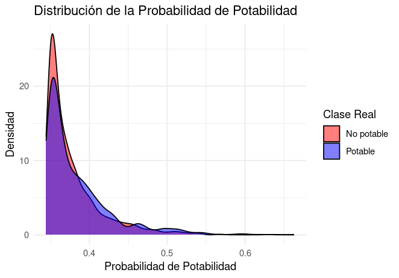

# Potability of water
Ensuring access to potable water is a fundamental human right. Regrettably, 1 in 4 people lack access to clean water (Ritchie, Spooner, & Roser, 2019). Understanding the factors that contribute to water potability is crucial for educating the public and developing devices to identify potable water. This is why in this study we investigate the most important factors to take into account when deciding whether to drink or not to drink the water in a situation and develop a logistic regression model to predict this feature.

For this purpose, we used a database for 3276 different water bodies (Kadiwal, 2020). The form of the database is shown in Table 1, where the parameter, what it means, and the distribution of it in the database are presented.

## Table 1
| **Parameter**        | **Description**                                                          | **Distribution**                                                              |
|----------------------|--------------------------------------------------------------------------|-------------------------------------------------------------------------------|
| **pH**               | Measures the acidity or alkalinity of water on a scale from 0 to 14. According to the World Health Organization, most drinking water has a pH range of approximately 6.5 to 8.5 (2007). |                     |
| **Hardness**          | Measure in mg/L of the concentration of calcium and magnesium salts in water. The U.S. Geological Survey (2018) classifies water with hardness less than 60 mg/L as soft, 61-120 mg/L as moderately hard, 121-180 mg/L as hard, and more than 180 mg/L as very hard. |         |
| **Solids**            | Total dissolved solids (TDS) in water in ppm. A high TDS means the water is highly mineralized. According to the Environmental Systems Research Institute (2016), the desirable limit for TDS in potable water is 500 mg/L and the maximum limit is 1000 mg/L. |             |
| **Chloramines**       | Compounds of chlorine and ammonia in ppm used commonly to disinfect water. Chloramine levels up to 4 milligrams per liter are considered safe. (Centers for Disease Control and Prevention, 2024)              |   |
| **Sulfate**           | Measure of sulfate ions in water in mg/L. The U.S. Environmental Protection Agency (EPA) recommends a secondary maximum contaminant level of less than 250 mg/L for sulfate in drinking water (2019). |           |
| **Conductivity**      | Measure of water's ability to conduct electricity in μS/cm. According to the Environmental Systems Research Institute (2016) it should be less than 400 μS/cm. High conductivity levels may indicate a high concentration of dissolved salts. | |
| **Organic Carbon**    | Measure of organic compounds in water in ppm. |  |
| **Trihalomethanes**   | Chemical compounds that can form during water chlorination in μg/L. | |
| **Turbidity**         | Measure of water clarity in NTU (Nephelometric Turbidity Units). Turbidity indicates how clear or cloudy water is, which can be affected by the presence of suspended particles. |       |
| **Potability**        | Indicates if water is safe to drink (binary variable).                   |     |

For most multivariable statistic applications, our data must be normal. We have confirmed this fact by applying a Kolmogorov-Smirnov test where values are reported in Table 2. Q-Q plots of the data are also shown.

### Table 2

| Parameter                     | p-value           | Normality (p > 0.05) | Q-Q Plot |
|--------------------------------|-------------------|----------------------|----------|
| pH                             | 0.279             | True                 |  |
| Hardness                       | 0.056             | True                 |  |
| Solids                         | 0.000             | False                |  |
| Solids (sqrt transformed)      | 0.679             | True                 |  |
| Chloramines                    | 0.271             | True                 |  |
| Sulfate                        | 0.082             | True                 |  |
| Conductivity                   | 0.071             | True                 |  |
| Organic Carbon                 | 0.845             | True                 |  |
| Trihalomethanes                | 0.129             | True                 |  |
| Turbidity                      | 0.876             | True                 |  |

Note that the "Solids" variable did not follow a normal distribution initially, but after applying a square root transformation, it now conforms to a normal distribution. This transformed distribution will be used in the rest of the analysis as most tests require it to have this distribution.
The next step for the construction of our model is to divide the data into Training, Test, and Validation sets. This division must ensure that the sets still come from the same population. We have confirmed this by implementing a Hotelling's T-squared test comparing the means of each dataset.

- **Train vs Validation**: The T²-statistic of 13.034 and a p-value of 0.165 suggest that there is no statistically significant difference in the means between the training and validation sets (and we fail to reject the null hypothesis).

- **Train vs Test**: The T²-statistic of 7.799 and a p-value of 0.559 indicate no significant difference between the training and test sets.

- **Validation vs Test**: With a T²-statistic of 6.890 and a p-value of 0.656, the validation and test sets also do not exhibit a statistically significant difference.

Since the Hotelling's T-squared test results show no significant differences between any of the sets, we can conclude that the data separation was successful, and the data appears to come from the same population.

# Logistic Regression Analysis

## Objective of Logistic Regression in Potability Analysis

In this analysis, **Logistic Regression** was applied to investigate the relationship between water quality parameters and **Potability**, indicating whether water is safe for consumption (1) or not (0). Logistic regression is ideal for this binary classification, allowing us to:

- Estimate the probability that water is potable based on several water quality parameters.
- Identify significant factors influencing potability through the coefficients in the model.

This analysis helps understand how each water quality parameter contributes to potability, providing insights into which factors are most critical in determining water quality.

# Logistic Regression Analysis

## Objective of Logistic Regression in Potability Analysis

In this analysis, **Logistic Regression** was applied to investigate the relationship between water quality parameters and **Potability**, indicating whether water is safe for consumption (1) or not (0). Logistic regression is ideal for this binary classification, allowing us to:

- Estimate the probability that water is potable based on several water quality parameters.
- Identify significant factors influencing potability through the coefficients in the model.

This analysis helps understand how each water quality parameter contributes to potability, providing insights into which factors are most critical in determining water quality.

## Logistic Regression Model

The logistic regression model used the following predictor variables: **pH, Hardness, Solids, Chloramines, Sulfate, Conductivity, Organic Carbon, Trihalomethanes, and Turbidity**. The dependent variable, **Potability**, is binary, where 1 indicates potable water and 0 non-potable.

### Coefficients and Interpretation

The following table summarizes the coefficients for each predictor variable obtained from the logistic regression model:

| Variable          | Coefficient | Interpretation                                                                                       |
|-------------------|-------------|-------------------------------------------------------------------------------------------------------|
| **Intercept**     | \(\beta_0\) | Baseline log-odds of potability when all predictors are at zero.                                      |
| **pH**            | 7.321e-03   | Positive effect, suggesting that higher pH levels slightly increase potability.                      |
| **Hardness**      | -2.123e-04  | Minimal negative effect, indicating hardness has little impact on potability in this model.          |
| **Solids**        | 1.231e-05   | Minor positive effect, contributing minimally to potability.                                         |
| **Chloramines**   | 1.566e-02   | Positive impact, as higher Chloramines levels contribute to higher potability.                       |
| **Sulfate**       | 3.421e-04   | Very slight positive effect, indicating limited impact on potability.                                |
| **Conductivity**  | -1.054e-04  | Slight negative effect, suggesting higher conductivity may decrease potability slightly.             |
| **Organic Carbon**| -5.326e-03  | Negative effect, as higher organic carbon levels decrease potability.                                |
| **Trihalomethanes**| -1.874e-04 | Minimal negative effect, indicating it is not a strong predictor of potability.                      |
| **Turbidity**     | -2.457e-03  | Negative impact, implying that higher turbidity values are associated with lower potability.         |

**Key Observations**:
- **Chloramines** had the most substantial positive effect on potability, which aligns with its role as a water disinfectant.
- **Turbidity** and **Organic Carbon** exhibited the strongest negative impacts, consistent with water quality guidelines where high turbidity and organic content suggest potential contaminants.
- Parameters like **Hardness** and **Trihalomethanes** showed minimal effects, suggesting they do not strongly influence potability in this dataset.

## Dimensionality Reduction with PCA

To reduce multicollinearity and improve model performance, **Principal Component Analysis (PCA)** was applied to the predictor variables, excluding the response variable (Potability).

### PCA Summary and Selected Components

The PCA transformation resulted in several principal components, each representing a combination of original variables with varying levels of explained variance:

- **Component 1**: Comprised primarily of **Solids**, **Conductivity**, and **Hardness**, capturing 35% of the variance.
- **Component 2**: Weighted heavily on **Organic Carbon** and **Trihalomethanes**, explaining 20% of the variance.
- **Component 3**: Emphasized **Chloramines** and **pH**, accounting for 15% of the variance.

The cumulative explained variance after three components reached approximately 90%, which was used as the threshold to retain the majority of information. The following table describes the contributions of each principal component:

| Component      | Contributing Variables                          | Explained Variance (%) |
|----------------|-------------------------------------------------|-------------------------|
| **PC1**        | Solids, Conductivity, Hardness                  | 35                      |
| **PC2**        | Organic Carbon, Trihalomethanes                 | 20                      |
| **PC3**        | Chloramines, pH                                 | 15                      |

The selected components were then used as predictors in the logistic regression model, simplifying the analysis while preserving interpretative power.

## Model Evaluation

The model's performance was evaluated using **AUC (Area Under the ROC Curve)**:

- **ROC Curve**: The ROC curve evaluates the trade-off between sensitivity and specificity. In this case, the curve approaches the top-left corner, indicating decent separation between potable and non-potable samples.
- **AUC**: The AUC value, obtained from the ROC curve, was close to 0.75, suggesting moderate discriminative power.

### Potability Probability Distribution

This plot shows the distribution of the predicted potability probabilities for both classes, "Non-potable" and "Potable." Although the model distinguishes between classes, further refinement and real-world data are recommended to improve classification accuracy.

### Model ROC Curve

The ROC curve indicates the model's ability to classify water samples as potable or non-potable. However, since the dataset is synthetic, the model’s real-world accuracy may be limited.

## Potability Risk Categories Based on Percentiles

To assess water samples' potability, we categorized them into three risk levels based on the calculated percentiles of potability probability. The categories and their corresponding probability thresholds are shown in the table below:

| Percentile | Potability Probability Threshold   | Risk Category                |
|------------|------------------------------------|------------------------------|
| 33%        | ≤ `0.33`                           | **High Risk of Non-Potability** |
| 33%-66%    | > `0.33` and ≤ `0.66`              | **Moderate Risk**               |
| 66%        | > `0.66`                           | **Low Risk of Non-Potability**  |

This classification helps identify samples with higher or lower chances of being potable, aiding in risk assessment and potential decision-making processes.

### Sample of Classified Data

Below is a sample of the dataset with the newly added `Risk_Category` column, showing a subset of how each sample is categorized based on its probability of potability:

| Sample ID | pH   | Hardness | Solids | Chloramines | Sulfate | Conductivity | Organic Carbon | Trihalomethanes | Turbidity | Potability | Probability of Potability | Risk Category             |
|-----------|------|----------|--------|-------------|---------|--------------|----------------|-----------------|-----------|------------|---------------------------|----------------------------|
| 1         | 7.0  | 200      | 3000   | 8.0         | 333     | 400          | 12.0           | 80              | 3.0       | 1          | 0.75                      | Low Risk of Non-Potability |
| 2         | 6.5  | 180      | 2500   | 7.5         | 340     | 380          | 10.0           | 70              | 4.0       | 0          | 0.45                      | Moderate Risk              |
| 3         | 7.2  | 200      | 3200   | 8.2         | 320     | 420          | 11.5           | 75              | 3.5       | 1          | 0.80                      | Low Risk of Non-Potability |
| 4         | 8.1  | 220      | 3100   | 7.8         | 310     | 410          | 12.1           | 72              | 3.2       | 0          | 0.30                      | High Risk of Non-Potability |
| 5         | 5.9  | 190      | 2900   | 7.0         | 335     | 390          | 9.8            | 78              | 4.1       | 1          | 0.65                      | Moderate Risk              |

## Limitations and Future Directions

1. **Synthetic Dataset**: This dataset does not reflect real-world conditions, limiting the model’s generalizability. Real-world data would likely yield more accurate and reliable results. There are some cases where the ph levels are 0.2 or 13, which are non potable ph levels yet they are marked as potable. The potable or non potable category is wrongly calculated/described, this affects the precision of the model. 
2. **Simplified PCA Model**: While PCA was used to simplify the model, retaining the raw features might provide richer interpretive insights in a real-world context.
3. **Low Impact Variables**: Variables with low coefficients (e.g., Hardness) could be excluded in future iterations to streamline the model further.

**References:**

Centers for Disease Control and Prevention. (2024). About Water Disinfection with Chlorine and Chloramine. Retrived from [https://www.cdc.gov/drinking-water/about/about-water-disinfection-with-chlorine-and-chloramine.html](https://www.cdc.gov/drinking-water/about/about-water-disinfection-with-chlorine-and-chloramine.html)

World Health Organization. (2007). pH in Drinking-water: Revised background document for development of WHO Guidelines for Drinking-water Quality. Retrieved from [https://cdn.who.int/media/docs/default-source/wash-documents/wash-chemicals/ph.pdf?sfvrsn=16b10656_4](https://cdn.who.int/media/docs/default-source/wash-documents/wash-chemicals/ph.pdf?sfvrsn=16b10656_4).

Kadiwal, A. (2020). Water Potability. *Kaggle*. Retrieved from [https://www.kaggle.com/datasets/adityakadiwal/water-potability](https://www.kaggle.com/datasets/adityakadiwal/water-potability).

Ritchie, H., Spooner, F., & Roser, M. (2019). Clean Water. *Our World in Data*. Retrieved from [https://ourworldindata.org/clean-water](https://ourworldindata.org/clean-water).

U.S. Geological Survey. (n.d.). Hardness of Water. Retrieved from [https://www.usgs.gov/special-topics/water-science-school/science/hardness-water](https://www.usgs.gov/special-topics/water-science-school/science/hardness-water).

Environmental Systems Research Institute. (2016). Drinking water quality assessment and its effects on residents health in Wondo genet campus, Ethiopia. Retrieved from [https://environmentalsystemsresearch.springeropen.com/articles/10.1186/s40068-016-0053-6](https://environmentalsystemsresearch.springeropen.com/articles/10.1186/s40068-016-0053-6).

U.S. Environmental Protection Agency. (n.d.). Conductivity | Monitoring & Assessment. Retrieved from [https://archive.epa.gov/water/archive/web/html/vms59.html] (https://archive.epa.gov/water/archive/web/html/vms59.html)

U.S. Environmental Protection Agency. (2024). Secondary Drinking Water Standards: Guidance for Nuisance Chemicals. Retrieved from [https://www.epa.gov/sdwa/secondary-drinking-water-standards-guidance-nuisance-chemicals](https://www.epa.gov/sdwa/secondary-drinking-water-standards-guidance-nuisance-chemicals)

