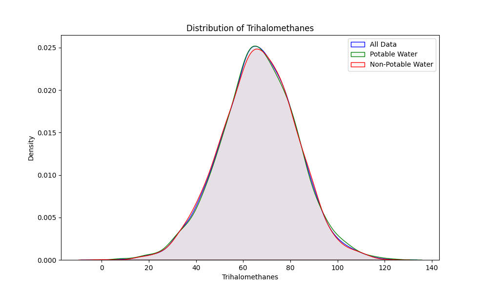
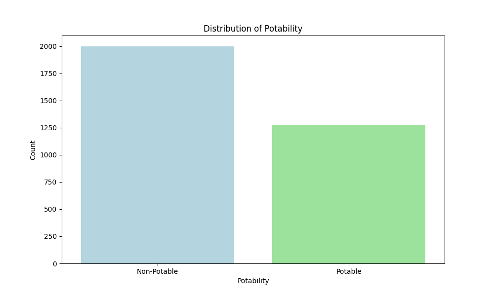
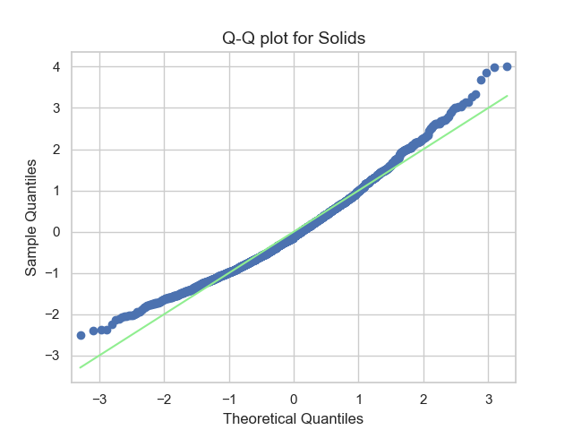
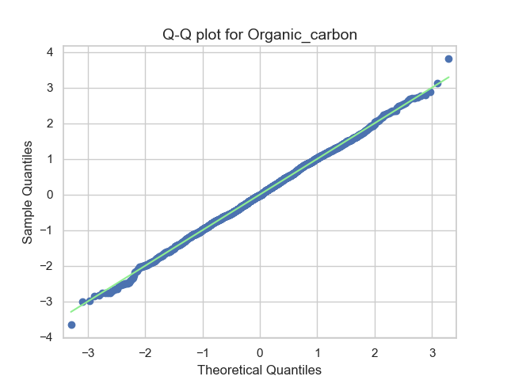

markdown
Copiar código
# Potabilidad del agua
Garantizar el acceso a agua potable es un derecho humano fundamental. Lamentablemente, 1 de cada 4 personas carece de acceso a agua limpia (Ritchie, Spooner, & Roser, 2019). Comprender los factores que contribuyen a la potabilidad del agua es crucial para educar al público y desarrollar dispositivos que identifiquen agua potable. Es por eso que en este estudio investigamos los factores más importantes a tener en cuenta al decidir si beber o no el agua en una situación determinada y desarrollamos un modelo de regresión logística para predecir esta característica.

Para este propósito, utilizamos una base de datos de 3276 cuerpos de agua diferentes (Kadiwal, 2020). La forma de la base de datos se muestra en la Tabla 1, donde se presentan el parámetro, su significado y su distribución en la base de datos.

## Tabla 1
| **Parámetro**        | **Descripción**                                                          | **Distribución**                                                              |
|----------------------|--------------------------------------------------------------------------|-------------------------------------------------------------------------------|
| **pH**               | Mide la acidez o alcalinidad del agua en una escala de 0 a 14. Según la Organización Mundial de la Salud, la mayoría del agua potable tiene un rango de pH de aproximadamente 6.5 a 8.5 (2007). |                     |
| **Dureza**           | Medida en mg/L de la concentración de sales de calcio y magnesio en el agua. El Servicio Geológico de EE. UU. (2018) clasifica el agua con dureza inferior a 60 mg/L como blanda, de 61-120 mg/L como moderadamente dura, de 121-180 mg/L como dura y superior a 180 mg/L como muy dura. |         |
| **Sólidos**          | Sólidos totales disueltos (TDS) en agua en ppm. Un TDS alto significa que el agua está altamente mineralizada. Según el Instituto de Investigación de Sistemas Ambientales (2016), el límite deseable de TDS en agua potable es 500 mg/L y el límite máximo es 1000 mg/L. |             |
| **Cloraminas**       | Compuestos de cloro y amoníaco en ppm utilizados comúnmente para desinfectar el agua. Los niveles de cloraminas de hasta 4 miligramos por litro se consideran seguros (Centros para el Control y la Prevención de Enfermedades, 2024).              |   |
| **Sulfato**          | Medida de iones de sulfato en agua en mg/L. La Agencia de Protección Ambiental de EE. UU. (EPA) recomienda un nivel máximo secundario de contaminante de menos de 250 mg/L de sulfato en agua potable (2019). |           |
| **Conductividad**    | Medida de la capacidad del agua para conducir electricidad en μS/cm. Según el Instituto de Investigación de Sistemas Ambientales (2016), debe ser inferior a 400 μS/cm. Los niveles altos de conductividad pueden indicar una alta concentración de sales disueltas. | |
| **Carbono Orgánico** | Medida de compuestos orgánicos en agua en ppm. |  |
| **Trihalometanos**   | Compuestos químicos que pueden formarse durante la cloración del agua en μg/L. | |
| **Turbidez**         | Medida de la claridad del agua en NTU (Unidades Nefelométricas de Turbidez). La turbidez indica cuán clara o turbia está el agua, lo cual puede verse afectado por la presencia de partículas suspendidas. |       |
| **Potabilidad**      | Indica si el agua es segura para beber (variable binaria).                   |     |

Para la mayoría de las aplicaciones estadísticas multivariables, nuestros datos deben ser normales. Hemos confirmado este hecho aplicando una prueba de Kolmogorov-Smirnov cuyos valores se informan en la Tabla 2. También se muestran los gráficos Q-Q de los datos.

### Tabla 2

| Parámetro                     | p-valor           | Normalidad (p > 0.05) | Gráfico Q-Q |
|--------------------------------|-------------------|----------------------|----------|
| pH                             | 0.279             | Verdadero            |  |
| Dureza                         | 0.056             | Verdadero            |  |
| Sólidos                        | 0.000             | Falso                |  |
| Sólidos (transformación raíz cuadrada) | 0.679  | Verdadero            |  |
| Cloraminas                     | 0.271             | Verdadero            |  |
| Sulfato                        | 0.082             | Verdadero            |  |
| Conductividad                  | 0.071             | Verdadero            |  |
| Carbono Orgánico               | 0.845             | Verdadero            |  |
| Trihalometanos                 | 0.129             | Verdadero            |  |
| Turbidez                       | 0.876             | Verdadero            |  |

Note que la variable "Sólidos" no seguía una distribución normal inicialmente, pero después de aplicar una transformación de raíz cuadrada, ahora se ajusta a una distribución normal. Esta distribución transformada se usará en el resto del análisis, ya que la mayoría de las pruebas lo requieren.

El siguiente paso para la construcción de nuestro modelo es dividir los datos en conjuntos de Entrenamiento, Prueba y Validación. Esta división debe asegurar que los conjuntos provienen de la misma población. Esto se ha confirmado mediante la implementación de una prueba Hotelling's T-cuadrado comparando las medias de cada conjunto de datos.

- **Entrenamiento vs Validación**: El estadístico T² de 13.034 y un valor p de 0.165 sugieren que no hay una diferencia estadísticamente significativa en las medias entre los conjuntos de entrenamiento y validación (y no rechazamos la hipótesis nula).

- **Entrenamiento vs Prueba**: El estadístico T² de 7.799 y un valor p de 0.559 indican que no hay una diferencia significativa entre los conjuntos de entrenamiento y prueba.

- **Validación vs Prueba**: Con un estadístico T² de 6.890 y un valor p de 0.656, los conjuntos de validación y prueba tampoco muestran una diferencia estadísticamente significativa.

Dado que los resultados de la prueba de Hotelling's T-cuadrado no muestran diferencias significativas entre ninguno de los conjuntos, podemos concluir que la separación de los datos fue exitosa y los datos parecen provenir de la misma población.

# Análisis de Regresión Logística

## Objetivo de la Regresión Logística en el Análisis de Potabilidad

En este análisis, se aplicó **Regresión Logística** para investigar la relación entre los parámetros de calidad del agua y **Potabilidad**, indicando si el agua es segura para el consumo (1) o no (0). La regresión logística es ideal para esta clasificación binaria, lo que nos permite:

- Estimar la probabilidad de que el agua sea potable en función de varios parámetros de calidad del agua.
- Identificar factores significativos que influyen en la potabilidad a través de los coeficientes en el modelo.

Este análisis ayuda a comprender cómo cada parámetro de calidad del agua contribuye a la potabilidad, proporcionando información sobre qué factores son más críticos para determinar la calidad del agua.

## Modelo de Regresión Logística

El modelo de regresión logística utilizó las siguientes variables predictoras: `pH`, `Dureza`, `Sólidos`, `Cloraminas`, `Sulfato`, `Conductividad`, `Carbono Orgánico`, `Trihalometanos` y `Turbidez`. Estos parámetros se transformaron según fue necesario para cumplir con los supuestos de normalidad y fueron estandarizados para el análisis.

## Resultados del Modelo y Métricas de Evaluación
